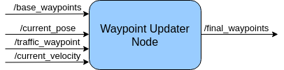

# System Architecture

The under diagramm shows the system architecture of this project.

## 1. Waypoint Updater

The way point_updater_node takes the waypoints published by different nodes and translates them into a list of waypoints each to be hit with a target velocity. This is fed to the controller to drive the ego car. Using the known waypoints provided on start-up, this node find the next set of nearest waypoints and the speed at which the car must hit these waypoints. The implementation steps are:

1. Detect the nearest set of waypoint ahead of the car.
2. Detect the traffic lights, and determin the next driving behavior.
3. Calcute the targe velocities for each waypoint.
4. publish the target wayypoints along with their velocities.

## 2. Drive-by-wire Node

The drive_by_wire_node receive the information of the current_velocity, twist_cmd and the dbw_enabled of the ego car, which used to determine the next driving operation. And than it publishes the throttle_cmd, steering_cmd and the breake_cmd to the simulator.

* twist_cmd:
Twist commands are published by the waypoint follower node. DBW node subscribes to this topic and produces the required output in terms of throttle, brake, and steering commands.

* current_velocity:
This is published by the simulator in our case and used by DBW node to determine the linear velocity of the car and provide it to the controller

* vehicle/dbw_enabled:
This is a status of DBW electronic system that is also published by the simulator in our case. DBW node will use this status to determine whether the brake, throttle and steering are to be published to respective topics or not

Outputs from the DBW node are the throttle, brake and steering commands published to the throttle_cmd, brake_cmd and steering_cmd topics.

## 3. Traffic Light Detector 

The traffic light detector receives the information of base_waypoints, image_color, current_pose and vehicle/traffic_lights and publish the determined traffic_waypoint.

The perception block consists of Obstacle Detection and Traffic Light Detection node. For the purpose of this project, I am only considering traffic lights as obstacles. Traffic Light Detection node takes in data from the /image_color, /current_pose, and /base_waypoints topics and publishes the locations to stop for red traffic lights to the /traffic_waypoint topic. As mentioned earlier, Waypoint Updater node will make use of this information to determine vehicle velocity for given waypoints. The traffic light classifier node is implemented separately and is independent of the Traffic light Detection node, which implements the logic to publish information regarding where the vehicle should come to a stop.

* base_waypoints : Complete list of waypoints for the test-track is used to stop at a waypoint in front of traffic-lights.

* image_color : Contains frontal camera image stream in order to detect and classify the traffic lights.

* current_pose : Used to determine car's location.

* vehicle/traffic_lights : Contains traffic lights' position in 3D space (x, y, z).

* traffic_waypoint : Waypoint nearest to a red light's stop-line. Is used by the [waypoint-updater](#waypoint-updater) node to stop the car near the traffic light.

## Implementation

This project is implementated on the Udacity workspace. The implemented Hardwares are:

* 31.4 GiB Memory
* Intel Core i7-6700K CPU @ 4 GHz x 8
* TITAN X Graphics
* 64-bit OS

